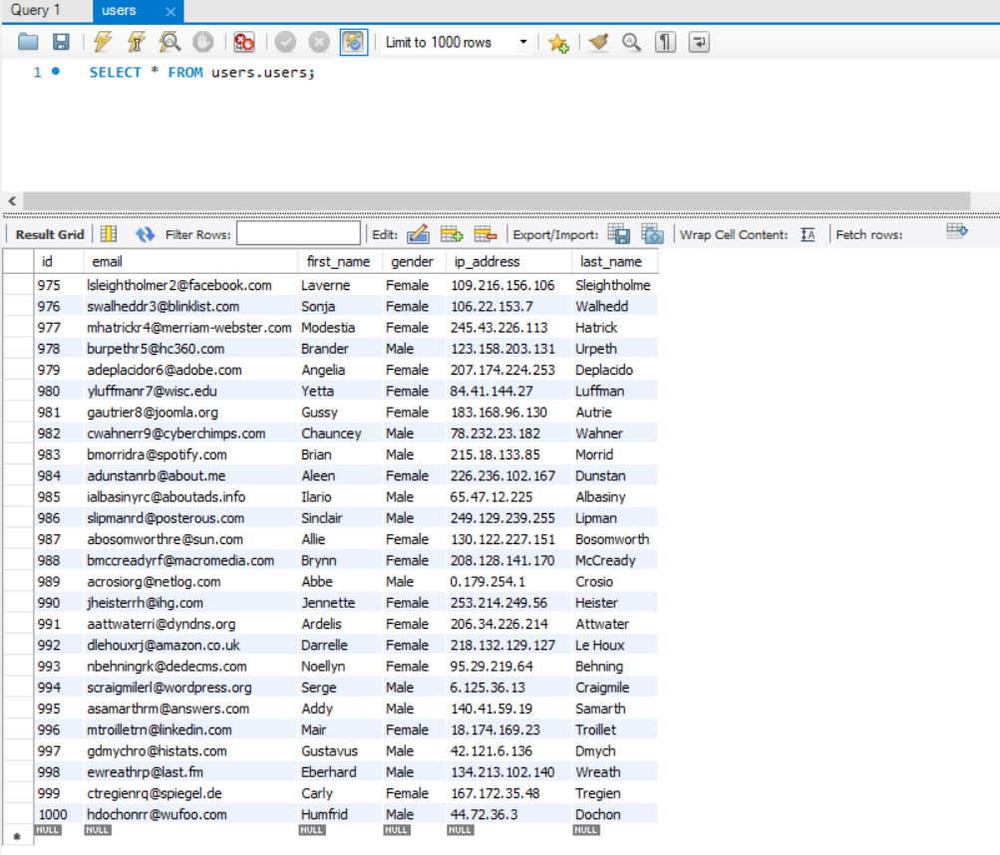
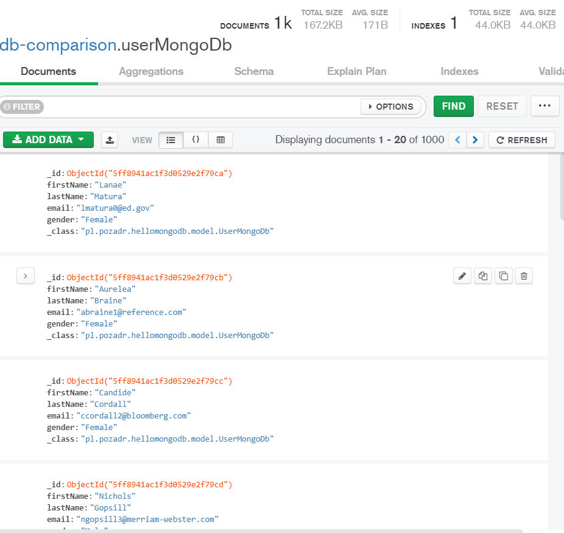
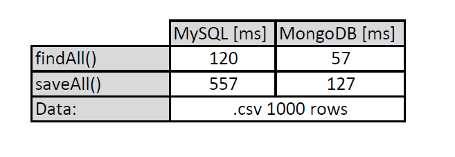

# AS_SQL_noSQL_comparison
[*Spring boot 2 academy*](https://www.akademiaspring.pl/)

## General
Application uses aspects to measure the time of query for MongoDB and MySQL. CSV(*.csv*) file is used as a data sample. 
The prepared file [*./data/MOCK_DATA.csv*](https://www.mockaroo.com/) has 1000 rows. Both DBs were tested as local hosts.

## Configuration

application.properties file:

    spring.datasource.url=
    spring.datasource.username=
    spring.datasource.password=
    spring.datasource.driver-class-name=
    spring.jpa.hibernate.ddl-auto=create

    spring.data.mongodb.uri=

    

## Technologies
- Java 11
- Maven
- Spring Boot 2.4.0
- MySQL (*localhost*)
- MongoDB (*localhost*)

## Screenshots

